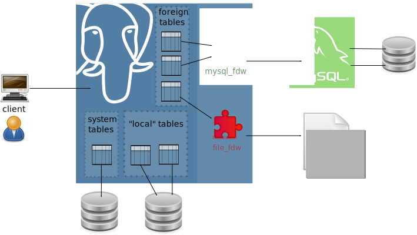
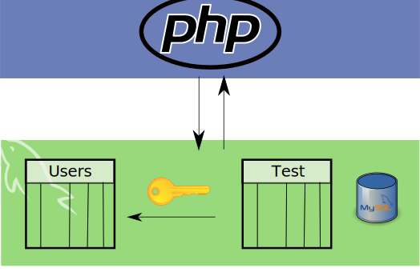
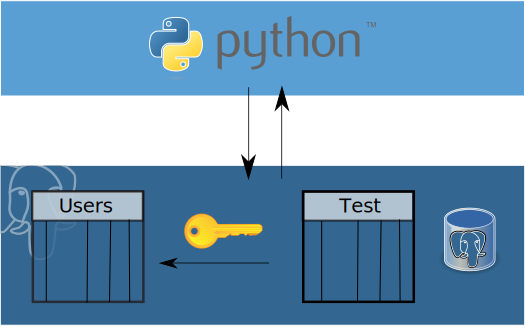
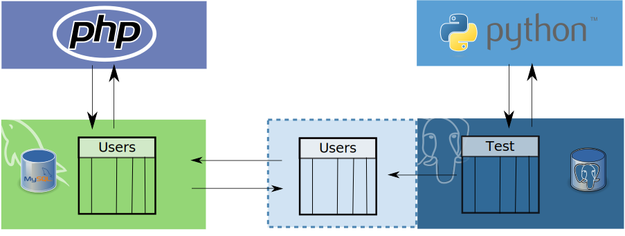
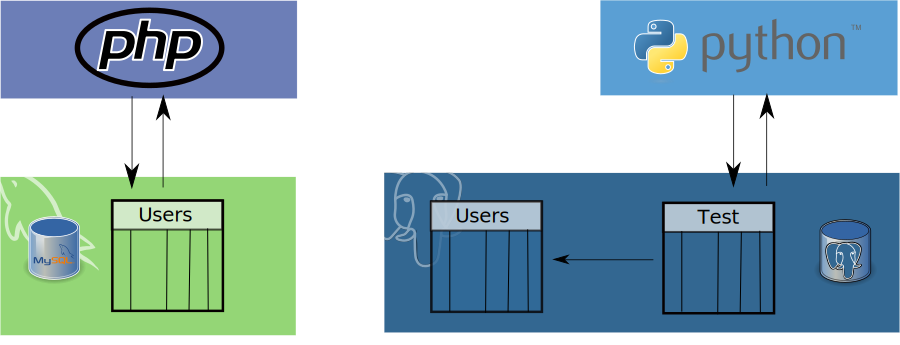
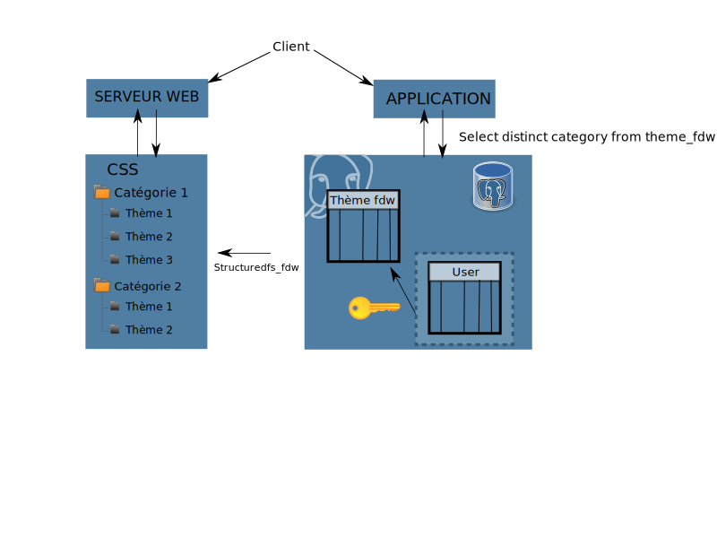
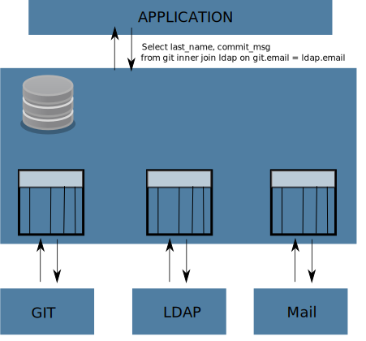

=================================================
Retour d'expérience sur les Foreign Data Wrappers
=================================================

:auteur: Kozea - Ronan Dunklau
:date: 07-06-2012

Retour d'expérience sur les FDW
===============================

Programme
---------

- FDW - Qu'est-ce que c'est ?
- Retour d'expérience
  
  - Migration
  - Extension de stockage
  - ETL
  - API SQL

À propos de Kozea
=================

- Société de services informatique à destination des professionnels de santé.
- Développement Web.
- Utilisateurs de PostgreSQL.

.. class:: incremental

    - SGBDR de choix pour tout les projets depuis 2010.
    - Exploitation des fonctionnalités "developer-friendly"

Foreign Data Wrapper - Kézako ?
===============================

.. class:: incremental

- Apparus dans Postgresql 9.1
- Offre une API pour accéder à des données externes
- Implémentation du standard SQL/MED

Foreign Data Wrapper - Vue d'ensemble
=====================================

  
  © 2012 Damien Clochard, used under a Creative Commons Attribution-ShareAlike license
  http://creativecommons.org/licenses/by-sa/3.0/

Mise en place
=============

Création du FDW
---------------

- Implémentation en C
- Packaging en extension
- Pour l'utilisateur

.. code-block:: sql

  CREATE EXTENSION file_fdw;

Mise en place
=============

Création du serveur
-------------------

.. code-block:: sql

  CREATE SERVER fileserver FOREIGN DATA WRAPPER file_fdw;

Création de la table
--------------------

.. code-block:: sql

  CREATE FOREIGN TABLE myfiletable (
    id integer,
    label  varchar,
    amount numeric,
    invoice_date date
  ) SERVER fileserver OPTIONS (
    filename '/path/to/my/file.csv',
    format 'csv',
    delimiter ';',
    header 'false',
  );

FDW disponibles
===============

- SGBDR
  
  - postgresql
  
  - oracle
  
  - mysql

- Fichiers

  - file_fdw
  
  - file_text_array_fdw

- "Exotiques"
  
  - twitter_fdw
  
  - www_fdw

  - multicorn

Cas n°1: migration
==================

Migration
---------

Cas n°1: migration
==================

Contexte
--------

- Application composée de deux parties

  - "Publique" : inscription d'utilisateurs
  - "Privée": réalisation de "tests" auprès d'utilisateurs sélectionnés.

- Migration php/mysql -> python/postgresql

Cas n°1: migration
==================

Avant ...
---------

Cas n°1: migration
==================

Objectif
--------

Cas n°1: migration
==================

Transition
----------

- Mise en place d'un FDW vers l'ancienne base.
- Recherche des utilisateurs de l'ancienne base.
- Population des colonnes référençant ces utilisateurs.

Cas n°1: migration
==================

Transition
----------

Cas n°1: migration
==================

Transition
----------

Cas n°1: migration
==================

Bascule complète
----------------

- Migration de la partie publique
- Migration des données elles mêmes
  
  .. code-block:: sql

  BEGIN;  
  CREATE TABLE user_temp AS (SELECT * FROM user);
  ALTER TABLE test ADD FOREIGN KEY (user_id) REFERENCES user(user_id);
  DROP TABLE user;
  ALTER TABLE user_temp RENAME TO user;
  COMMIT;

Bilan
=====

.. class:: plus_icon

- Aucune modification apportée à l'ancien système
- Aucun développement spécifique pour la transition
- Modifications limitées à la BDD

Cas n°2: Exploiter le système de fichier
========================================

Contexte
--------

- Application web permettant à l'utilisateur de choisir un thème graphique.
- Thèmes stockés sur un système de fichier partagés, prêt à êtres servis.
- Comment garantir une liste de thèmes cohérentes ?

Cas n°2: Exploiter le système de fichier
========================================

Solution
--------

Cas n°2: Exploiter le système de fichier
========================================

Exemple
-------

  SELECT * from themes;

+------------+--------+
| categorie  | name   |
+============+========+
| categorie1 | theme1 |
+------------+--------+
| categorie1 | theme2 |
+------------+--------+
| categorie1 | theme3 |
+------------+--------+
| categorie2 | theme4 |
+------------+--------+
| categorie2 | theme5 |
+------------+--------+

Cas n°2: Exploiter le système de fichier
========================================

- Comment ajouter un thème ?
  
  .. class:: incremental

  Simplement en déployant son répertoire au bon endroit.

- Lister les thèmes

  - Puissance du sql pour ajouter les fonctionnalités autour
  - Utilisation du même outil, partout: ORM

Cas n°2: Exploiter le système de fichier
========================================

Bilan
-----
   
.. class:: plus_icon

- Fichiers stockés là où ils doivent être: sur le système de fichiers
- Configuration réalisée en BDD
- Liste toujours à jour
- SQL a disposition (*select distinct categorie from themes;*)

.. class:: minus_icon

- Mise en place d'environnemnents de développement parfois compliquée.

Cas n°3: ETL
============

Contexte
--------

- Import périodique de données au format CSV
- Mise à jour des données

Certainement le cas le plus fréquent

Cas n°3: ETL
============

Procédure
---------

- Téléchargement des fichiers
- Transformation dans la BDD (aggrégation, normalisation)
- Chargement dans les tables de l'application.

Cas n°3: ETL
============

Téléchargement des fichiers
---------------------------

Peut-être fait dans la BDD elle même!

.. code-block:: sql

  CREATE function update_csv_files() RETURNS VOID AS $$
  ...
  $$ language plpythonu;

.. class:: incremental

Attention à bien gérer les exceptions.

Cas n°3: ETL
============

Transformations des données
---------------------------

.. code-block:: sql

  INSERT INTO aggregate_by_month (product_id, amount, quantity, month) (
    select product_id, sum(amount), sum(quantity), date_trunc('month', date)
    FROM csv_amounts
    group by date_trunc('month', date)
  );

Cas n°3: ETL
============

Bilan
-----

.. class:: plus_icon

- Tout est fait dans la BDD
- simplicité de déploiement
- performant

.. class:: minus_icon

- Gestion des dépendances

Cas n°4: Postgresql comme API SQL.
==================================

Contexte
--------
.. class:: incremental

- Analyse en ligne de données croisées de différentes sources

  - Système de gestion de versions Git
  - Annuaire LDAP
  - Serveur IMAP ...

Cas n°4: Postgresql comme API SQL.
==================================

Architecture
------------

Cas n°4: Postgresql comme API SQL.
==================================

Example: le développement de PostgreSQL
---------------------------------------

Quel est le commiter s'exprimant le moins sur pg-hackers ?

.. class:: incremental

.. code-block:: sql
 
  Select (nb_msg / nb_commit) as ratio, author_email
  FROM
    (select count(distinct "Message-ID") as nb_msg, count(distinct
    hash) as nb_commit, author_email
    from mails
    inner join git on mails."From" like '%' || git.author_email || '%'
    where "To" like '%pgsql-hackers@postgresql.org%'
    group by "author_email") as t
  WHERE nb_commit > 0
  ORDER BY nb_msg / nb_commit;

Cas n°4: Postgresql comme API SQL.
==================================

Chez Kozea...
=============

- Application d'édition et d'archivage de documents.
- Utilisateurs -> LDAP
- Documents -> GIT

Questions
=========

Questions ?
